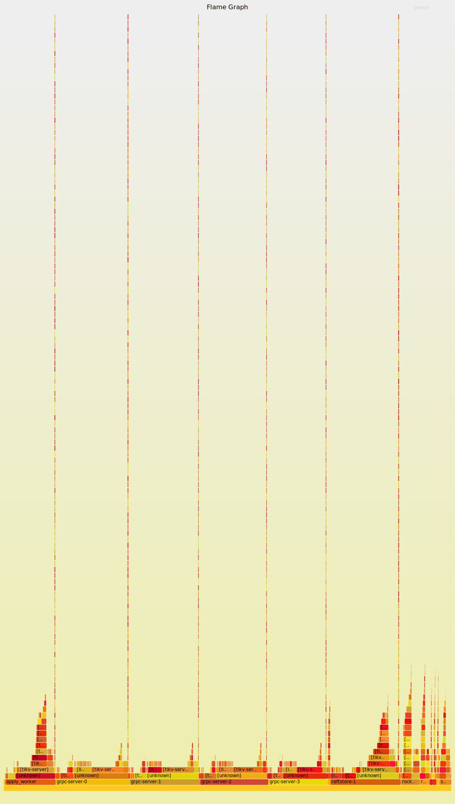

# 测试环境
* Windows10 4核16G（SSD）
  - Docker 18.03.1-ce
  - 容器：pingcap/pd x 1、centos x 1部署go-ycsb
* Debian 3.16.43 4核8G（经由KVM虚拟化，无SSD）
  - Docker 18.06.0-ce
  - 容器：pingcap/tikv x 3

两台机器间ping值为0.523ms

# 测试实例
环境变量
```
TiKVHostIP="10.246.46.81"
PDHostIP="10.240.184.47"
TZGPrivateFile="/home/tzgn5892/.private_tzg"
TikvMountData="$TZGPrivateFile/tikv_data"
```
tikv x 3，并设置cpu亲和

tikv1为Leader，tikv2、tikv3为Follower
```
docker run -d --name tikv1  -p 20161:20161   -v $TikvMountData:/data   --cpuset-cpus 0 pingcap/tikv:latest   --addr="0.0.0.0:20161"   --advertise-addr="${TiKVHostIP}:20161" --data-dir="/data/tikv1"   --pd="${PDHostIP}:2379"

docker run -d --name tikv2  -p 20162:20162   -v $TikvMountData:/data   --cpuset-cpus 1 pingcap/tikv:latest   --addr="0.0.0.0:20162"   --advertise-addr="${TiKVHostIP}:20162" --data-dir="/data/tikv2"   --pd="${PDHostIP}:2379"

docker run -d --name tikv3  -p 20163:20163   -v $TikvMountData:/data   --cpuset-cpus 2 pingcap/tikv:latest   --addr="0.0.0.0:20163"   --advertise-addr="${TiKVHostIP}:20163" --data-dir="/data/tikv3"   --pd="${PDHostIP}:2379"
```
pd x 1
```
docker run -d -p 2379:2379 -p 2380:2380 --name pd pingcap/pd --name="pd" --data-dir="pd" --client-urls="http://0.0.0.0:2379"           --advertise-client-urls="http://10.240.184.47:2379" --peer-urls="http://0.0.0.0:2380" --advertise-peer-urls="http://10.240.184.47:2380" --log-file=pd.log
```
go-ycsb的workloads配置
```
workload=core

readproportion=0
updateproportion=0
scanproportion=0
insertproportion=1

requestdistribution=zipfian
```

go-ycsb对tikv进行raw load 纯 insert 的压力测试

运行命令如下，插入1M数据，QPS为1634.7
```
[root@5f9a21f38843 go-ycsb]# ./bin/go-ycsb load tikv -P workloads/workload_raw_load -p tikv.pd="${PDHostIP}:2379" -p tikv.type="raw" -p recordcount=1000000
INFO[0000] [pd] create pd client with endpoints [10.240.184.47:2379]
INFO[0000] [pd] leader switches to: http://10.240.184.47:2379, previous:
INFO[0000] [pd] init cluster id 6583110271445162425
INSERT - Takes(s): 9.9, Count: 23256, QPS: 2353.1, Avg(us): 42878, Min(us): 17732, Max(us): 257349, 95th(us): 73000, 99th(us): 208000
INSERT - Takes(s): 19.9, Count: 43691, QPS: 2197.5, Avg(us): 45317, Min(us): 17732, Max(us): 323159, 95th(us): 99000, 99th(us): 221000
INSERT - Takes(s): 29.9, Count: 64029, QPS: 2142.7, Avg(us): 46736, Min(us): 17732, Max(us): 405037, 95th(us): 119000, 99th(us): 216000
INSERT - Takes(s): 39.9, Count: 75490, QPS: 1892.8, Avg(us): 52835, Min(us): 17732, Max(us): 647040, 95th(us): 141000, 99th(us): 349000
INSERT - Takes(s): 49.9, Count: 93794, QPS: 1880.3, Avg(us): 53216, Min(us): 17732, Max(us): 647040, 95th(us): 139000, 99th(us): 323000
INSERT - Takes(s): 59.9, Count: 113448, QPS: 1894.5, Avg(us): 52794, Min(us): 17732, Max(us): 647040, 95th(us): 138000, 99th(us): 290000
INSERT - Takes(s): 69.9, Count: 129572, QPS: 1854.1, Avg(us): 53932, Min(us): 17732, Max(us): 647040, 95th(us): 145000, 99th(us): 312000
INSERT - Takes(s): 79.9, Count: 146824, QPS: 1838.0, Avg(us): 54344, Min(us): 17732, Max(us): 647040, 95th(us): 148000, 99th(us): 311000
INSERT - Takes(s): 89.9, Count: 165221, QPS: 1838.2, Avg(us): 54379, Min(us): 17732, Max(us): 647040, 95th(us): 148000, 99th(us): 312000
INSERT - Takes(s): 99.9, Count: 185369, QPS: 1855.9, Avg(us): 53863, Min(us): 17732, Max(us): 647040, 95th(us): 147000, 99th(us): 302000

.
.
.

INSERT - Takes(s): 611.7, Count: 1000000, QPS: 1634.7, Avg(us): 60974, Min(us): 16032, Max(us): 12460709, 95th(us): 153000, 99th(us): 330000
```

**压测期间，负载主要落在Leader身上，所以以下检测指标均来自Leader所在进程**

用perf stat检测所得结果如下
* 由于测试机非实体物理机，所以cycles、instructions、stall等指标无法观测
* CPU占用率不高，非CPU密集型
* CPU迁移、内存缺页 指标无异常
* 上下文切换频率较高，IO阻塞、锁抢占都可能引起该问题

```
     101551.465078      task-clock (msec)         #    0.178 CPUs utilized          
         1,057,588      context-switches          #    0.010 M/sec                  
             2,358      cpu-migrations            #    0.023 K/sec                  
           567,619      page-faults               #    0.006 M/sec                  
   <not supported>      cycles                   
   <not supported>      stalled-cycles-frontend  
   <not supported>      stalled-cycles-backend   
   <not supported>      instructions             
   <not supported>      branches                 
   <not supported>      branch-misses            

     570.655272624 seconds time elapsed
```
直接用top命令查看CPU状态，可知CPU花在IO等待上的时间相对较多
```
%Cpu0  : 22.7 us,  7.8 sy,  0.0 ni, 33.6 id, 28.5 wa,  0.0 hi,  7.5 si,  0.0 st
%Cpu1  : 13.4 us,  5.4 sy,  0.0 ni, 49.8 id, 30.8 wa,  0.0 hi,  0.7 si,  0.0 st
%Cpu2  :  9.5 us,  2.4 sy,  0.0 ni, 67.1 id, 20.7 wa,  0.0 hi,  0.3 si,  0.0 st
%Cpu3  :  0.0 us,  0.0 sy,  0.0 ni,100.0 id,  0.0 wa,  0.0 hi,  0.0 si,  0.0 st
```
用perf检测cpu-clock信息，导出部分结果如下
```
Samples: 471K of event 'cpu-clock', Event count (approx.): 117967500000
+    5.09%     0.00%    grpc-server-0  [unknown]           [.] 0000000000000000
+    4.76%     0.00%    grpc-server-1  [unknown]           [.] 0000000000000000
+    4.03%     0.00%    grpc-server-2  [unknown]           [.] 0000000000000000
+    3.95%     0.00%    grpc-server-3  [unknown]           [.] 0000000000000000
+    3.85%     0.00%      raftstore-1  [unknown]           [.] 0x0000000000000001
```
将全部检测信息导成CPU火焰图如下
[](perf_flame_graph.svg)

可见Leader主要消耗CPU资源的地方是apply_worker、grpc-server和raftstore相关模块，但由于是docker容器内进程，所以缺少部分函数名信息

用perf检测block:block_rq_issue和block:block_rq_complete信息，导出部分结果如下
```
Samples: 96K of event 'block:block_rq_issue', Event count (approx.): 96194                                                
+   74.74%     0.00%      raftstore-1  libc-2.23.so        [.] 0x00000000000ddaed
+   74.74%    74.74%      raftstore-1  [kernel.kallsyms]   [k] blk_mq_start_request
+    5.21%     0.00%  split check wor  [unknown]           [.] 0x1d058d4818ec8348
+    5.21%     0.00%  split check wor  tikv-server         [.] 0x0000000000f61c10
+    5.21%     0.00%  split check wor  libpthread-2.23.so  [.] 0x0000000000010603
+    5.21%     5.21%  split check wor  [kernel.kallsyms]   [k] blk_mq_start_request
```
```
Samples: 24K of event 'block:block_rq_complete', Event count (approx.): 24011                                          
+   21.04%    21.04%    grpc-server-2  [kernel.kallsyms]   [k] blk_update_request
+   19.91%    19.91%    grpc-server-0  [kernel.kallsyms]   [k] blk_update_request
+   15.60%    15.60%    grpc-server-1  [kernel.kallsyms]   [k] blk_update_request
+   14.64%    14.64%    grpc-server-3  [kernel.kallsyms]   [k] blk_update_request
+    7.65%     0.00%    grpc-server-2  [unknown]           [.] 0000000000000000
+    6.80%     0.00%    grpc-server-0  [unknown]           [.] 0000000000000000
+    5.40%     5.40%      rocksdb:bg4  [kernel.kallsyms]   [k] blk_update_request
+    5.31%     5.31%  split check wor  [kernel.kallsyms]   [k] blk_update_request
```
将全部IO的发起和完成信息导出成延迟的热力图，如下
[](perf_heat_map.svg)

可以看出IO延迟大体上集中在5000us以内，但部分时段存在抖动

perf统计系统调用频率，大致在每秒28417.9次，相对较高
```
 Performance counter stats for process id '5100':

         8,252,570      raw_syscalls:sys_enter                                      

     290.404742374 seconds time elapsed
```

# 结论
* 由于测试环境的限制，目前仅能得出以下结论：
  - tikv不属于CPU密集型应用，CPU花在IO等待上的时间相对较多；热点函数详见火焰图；
  - 上下文切换频率较高，IO阻塞、锁抢占都可能引起该问题；
  - 瓶颈在磁盘IO，存在抖动，可能换成SSD后性能会更好，详见热力图；
  - 网络相关未测试，也是潜在的瓶颈，解决方法同磁盘IO
  - 系统调用频率相对较高，待查
* 其他
  - tikv对应的是spanner，如果不考虑跨IDC部署，用特定节点提供统一授时服务是一种简化方案。不然就得考虑类似TrueTime的硬件解决方案，或HLC之类实现起来非常复杂的方案
  - tikv仅作为kv存储，sql解析和执行由tidb执行，走分布式事务。这种模式通用性和可扩展性较强，但很难适应如电商秒杀之类存在明显数据热点的场景。对于目前这种kv和sql分离的架构而言，只能尽可能加大带宽内存，减少网络延迟
  - 分group的multi-raft模式性价比较高。一般也可以用multi-paxos + 滑动窗口这种乱序投票确认的模式替换raft，但在tikv的场景中意义不大